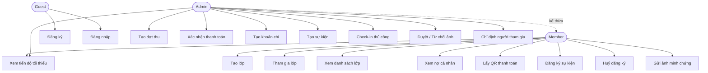

# 03 — Actor và Use Case

## 3.1. Danh sách Actor

ClassHub có **3 actor chính**. Role được gán theo từng lớp (qua bảng `class_members`), KHÔNG phải role toàn cục — một user có thể là Admin lớp này nhưng là Member lớp khác.

### 3.1.1. Guest
- Người chưa đăng nhập vào hệ thống.
- Truy cập được: màn đăng ký, đăng nhập.

### 3.1.2. Member
- Sinh viên đã đăng nhập, đã tham gia ít nhất 1 lớp.
- Truy cập dữ liệu của lớp mình tham gia.

### 3.1.3. Admin (Ban cán sự)
- Sinh viên có role `ADMIN` trong bảng `class_members` của lớp đó.
- Người tạo lớp tự động trở thành Admin của lớp mình tạo.
- Có toàn bộ quyền của Member + quyền quản lý lớp.

> **Note:** Đề cương gợi ý có thêm role `OWNER` (3 cấp). Hiện tại hệ thống chỉ có 2 cấp `ADMIN`/`MEMBER`. Việc thêm OWNER đưa vào hướng phát triển.

## 3.2. Bảng tổng hợp Actor × Chức năng

| Chức năng | Guest | Member | Admin |
|---|:---:|:---:|:---:|
| Đăng ký | ✅ | — | — |
| Đăng nhập | ✅ | — | — |
| Đăng xuất | — | ✅ | ✅ |
| Tạo lớp mới | — | ✅ (trở thành Admin của lớp) | ✅ |
| Tham gia lớp bằng mã mời | — | ✅ | ✅ |
| Xem danh sách lớp đã tham gia | — | ✅ | ✅ |
| Xem chi tiết lớp + mã mời | — | ✅ | ✅ |
| Xem danh sách đợt thu | — | ✅ (lớp mình) | ✅ |
| Tạo đợt thu | — | ❌ → 403 | ✅ (lớp mình) |
| Xem ai đóng/chưa đóng | — | ❌ → 403 | ✅ (lớp mình) |
| Xác nhận thanh toán | — | ❌ → 403 | ✅ (lớp mình) |
| Xem nợ cá nhân | — | ✅ (của mình) | ✅ |
| Lấy QR thanh toán | — | ✅ (khoản của mình) | ✅ (khoản của mình) |
| Xem trạng thái thanh toán | — | ✅ (khoản của mình) | ✅ |
| Tạo khoản chi | — | ❌ → 403 | ✅ (lớp mình) |
| Xem danh sách khoản chi | — | ✅ (lớp mình) | ✅ |
| Tạo sự kiện | — | ❌ → 403 | ✅ (lớp mình) |
| Xem danh sách sự kiện | — | ✅ (lớp mình) | ✅ |
| Đăng ký tham gia sự kiện | — | ✅ | ✅ |
| Thấy trạng thái tham gia (`VOLUNTEER`/`ASSIGNED`) | — | ✅ | ✅ |
| Huỷ đăng ký | — | ✅ nếu là `VOLUNTEER` và chưa check-in; `ASSIGNED` không được tự huỷ | ✅ |
| Xem tiến độ đủ/chưa đủ số lượng tối thiểu | — | ✅ (lớp mình) | ✅ |
| Thêm/chỉ định người tham gia sự kiện | — | ❌ → 403 | ✅ (lớp mình) |
| Xem danh sách người đăng ký | — | ❌ → 403 | ✅ (lớp mình) |
| Check-in (điểm danh) | — | ❌ → 403 | ✅ (lớp mình) |
| Gửi ảnh minh chứng điểm danh | — | ✅ (sự kiện đã đăng ký) | ✅ |
| Gửi lại ảnh nếu bị từ chối | — | ✅ | ✅ |
| Xem ảnh minh chứng | — | ❌ → 403 | ✅ (lớp mình) |
| Duyệt ảnh minh chứng | — | ❌ → 403 | ✅ (lớp mình) |
| Từ chối ảnh minh chứng | — | ❌ → 403 | ✅ (lớp mình) |
| Xem sự kiện mình đã đăng ký | — | ✅ | ✅ |

## 3.3. Use Case Diagram (mô tả văn bản)

```
                   ┌─────────────────────────────────────┐
                   │           Hệ thống ClassHub          │
                   ├─────────────────────────────────────┤
                   │                                      │
   Guest ─────────►│  • Đăng ký                          │
                   │  • Đăng nhập                        │
                   │                                      │
                   │  Quản lý lớp:                        │
   Member ───────► │  • Tạo lớp                          │
                   │  • Tham gia lớp                     │
                   │  • Xem danh sách lớp                │
                   │  • Xem chi tiết lớp                 │
                   │                                      │
                   │  Quỹ lớp — Sinh viên:                │
                   │  • Xem nợ cá nhân                   │
                   │  • Lấy QR thanh toán                │
                   │  • Xem trạng thái thanh toán        │
                   │  • Xem danh sách đợt thu của lớp    │
                   │  • Xem danh sách khoản chi          │
                   │                                      │
                   │  Sự kiện — Sinh viên:                │
                   │  • Xem danh sách sự kiện            │
                   │  • Đăng ký tham gia                 │
                   │  • Huỷ đăng ký nếu là VOLUNTEER     │
                   │  • Xem sự kiện đã đăng ký           │
                   │  • Thấy trạng thái BCS thêm         │
                   │  • Gửi ảnh minh chứng điểm danh     │
                   │  • Gửi lại ảnh nếu bị từ chối       │
                   │                                      │
   Admin ────────► │  Tất cả use case của Member +        │
   (≡ Member +     │                                      │
    extends)       │  Quỹ lớp — Quản lý:                  │
                   │  • Tạo đợt thu                      │
                   │  • Xem ai đóng/chưa đóng            │
                   │  • Xác nhận thanh toán              │
                   │  • Tạo khoản chi                    │
                   │                                      │
                   │  Sự kiện — Quản lý:                  │
                   │  • Tạo sự kiện                      │
                   │  • Xem tiến độ tối thiểu            │
                   │  • Thêm/chỉ định người tham gia     │
                   │  • Xem danh sách người đăng ký      │
                   │  • Check-in thủ công                │
                   │  • Xem ảnh minh chứng               │
                   │  • Duyệt ảnh minh chứng             │
                   │  • Từ chối ảnh minh chứng           │
                   └─────────────────────────────────────┘
```

> Quan hệ giữa actor: **Admin** là chuyên môn hoá của **Member**. Mọi use case của Member, Admin đều dùng được. Ngược lại không đúng.

## 3.4. Use Case Diagram (Mermaid — render được trên GitHub)



## 3.5. Mô tả chi tiết các Use Case quan trọng

### UC10 — Admin tạo đợt thu

**Actor:** Admin của lớp
**Mô tả:** Admin tạo một đợt thu mới (vd "Quỹ lớp tháng 5"). Hệ thống tự sinh bản ghi nợ cho mọi thành viên của lớp.

**Tiền điều kiện:**
- Đã đăng nhập, có Bearer token hợp lệ.
- User là Admin của lớp đang thao tác.

**Luồng chính:**
1. Admin mở màn "Tạo đợt thu" từ tab Khoản thu.
2. Nhập tiêu đề, số tiền, deadline (tuỳ chọn).
3. Bấm "Tạo đợt thu".
4. FE gọi `POST /api/fund/collections`.
5. BE validate: amount > 0, title không rỗng.
6. BE check `requireAdmin(currentUserId, classroomId)`.
7. BE tạo `FundCollection`, lưu DB.
8. BE query mọi `ClassMember` của lớp → tạo `FundPayment(user, collection, isPaid=false)` cho từng người.
9. BE trả response.
10. FE quay về tab Khoản thu, reload danh sách.

**Luồng phụ:**
- 5a. Validate fail → 400 với chi tiết field nào sai.
- 6a. User không phải Admin → 403 "Chỉ Ban cán sự được phép thao tác".

**Hậu điều kiện:**
- 1 bản ghi `fund_collections` mới.
- N bản ghi `fund_payments` mới (N = số thành viên).

---

### UC11 — Admin xác nhận thanh toán

**Actor:** Admin của lớp
**Mô tả:** Sau khi sinh viên đã chuyển khoản, Admin đối chiếu sao kê và bấm xác nhận để đánh dấu khoản đó đã đóng.

**Tiền điều kiện:**
- Admin đã mở màn `CollectionPaymentsScreen` của 1 đợt thu.
- Sinh viên đó chưa được xác nhận.

**Luồng chính:**
1. Admin nhìn danh sách payment, thấy chip "Chưa đóng" bên cạnh sinh viên A.
2. Bấm nút "Xác nhận".
3. App hiện confirm dialog: "Xác nhận em A đã đóng? Không thể hoàn tác."
4. Admin bấm "Xác nhận" lần 2.
5. FE gọi `PUT /api/fund/payments/{paymentId}/confirm`.
6. BE load payment, lấy classroomId qua `payment.fundCollection.classroom.id`.
7. BE check `requireAdmin(adminUserId, classroomId)`.
8. BE check idempotency: nếu `payment.confirmedByAdmin == true` → throw "Khoản này đã được xác nhận".
9. BE set `isPaid=true`, `confirmedByAdmin=true`, `paidAt=now()`, `confirmedBy=admin user`.
10. BE save + trả response có `confirmedByName`.
11. FE reload danh sách, sinh viên A chuyển trạng thái xanh.
12. (Async) Polling phía sinh viên A bắt đầu thấy `status="CONFIRMED"` trong ≤5s tiếp theo.

**Luồng phụ:**
- 3a. Admin bấm "Huỷ" → không gọi API.
- 7a. Admin không thuộc lớp của payment → 403.
- 8a. Đã xác nhận rồi → 400 "Khoản thu này đã được xác nhận".

**Hậu điều kiện:**
- `payment.confirmedBy_id` = id của admin.
- `payment.paidAt` có timestamp.
- Sinh viên thấy trạng thái cập nhật qua polling.

---

### UC7 — Sinh viên lấy QR thanh toán

**Actor:** Member
**Mô tả:** Sinh viên chuẩn bị chuyển khoản đóng quỹ. App sinh URL QR VietQR có sẵn nội dung chuyển khoản duy nhất.

**Luồng chính:**
1. Member ở section "Khoản của bạn", bấm "Xem QR" trên 1 khoản chưa đóng.
2. FE gọi `GET /api/fund/payments/{paymentId}/qr`.
3. BE check `payment.user.id == currentUserId` (chỉ chủ payment được xem).
4. BE check `payment.paymentCode`: nếu null thì sinh code mới `QUY{collectionId}-SV{userId}-{timestamp}`, lưu DB.
5. BE build URL VietQR: `https://img.vietqr.io/image/{bankBin}-{accountNo}-compact2.png?amount=...&addInfo=...&accountName=...`
6. BE trả `qrUrl`, `amount`, `paymentCode`, `collectionTitle`, `deadline`.
7. FE hiển thị QR + nội dung CK + nút copy.
8. FE bắt đầu polling `/status` mỗi 5s.

**Luồng phụ:**
- 3a. Không phải chủ payment → 403 "Bạn chỉ có thể xem QR của khoản đóng của chính mình".

---

### UC13 — Admin tạo sự kiện

**Actor:** Admin
**Luồng chính:**
1. Mở tab Sự kiện → FAB "Tạo sự kiện".
2. Nhập tiêu đề, mô tả, địa điểm, chọn ngày giờ và có thể nhập `minParticipants`.
3. FE gọi `POST /api/events` với `eventTime` ISO không có "Z" và `minParticipants` nếu có.
4. BE `requireAdmin`.
5. BE validate `minParticipants >= 0` nếu khác null, tạo `Event`, lưu DB.
6. FE quay về tab, reload list.

---

### UC8 — Sinh viên đăng ký tham gia sự kiện

**Actor:** Member
**Luồng chính:**
1. Member ở tab Sự kiện, bấm "Đăng ký" trên 1 sự kiện.
2. FE gọi `POST /api/events/{eventId}/volunteer`.
3. BE load event, `requireMember(userId, event.classroomId)`.
4. BE check `existsByEventIdAndUserId` → nếu đã đăng ký, throw "Đã đăng ký rồi".
5. BE tạo `EventParticipant(event, user, checkedIn=false, source=VOLUNTEER)`.
6. Unique constraint DB đảm bảo không lưu trùng dù có race condition.
7. FE reload → chip "Đã đăng ký" hiển thị.

---

### UC17 — Admin thêm/chỉ định người tham gia sự kiện

**Actor:** Admin của lớp
**Mô tả:** Khi số người tự đăng ký chưa đạt `minParticipants`, Admin mở chi tiết sự kiện và thêm thành viên lớp vào danh sách tham gia.

**Luồng chính:**
1. Admin tạo sự kiện có `minParticipants`.
2. Member tự đăng ký trước qua UC8, được lưu với `source=VOLUNTEER`.
3. Admin mở chi tiết sự kiện, FE gọi `GET /api/events/detail/{eventId}` để xem "Đã tham gia X/Y, còn thiếu N".
4. Nếu chưa đủ người, FE lấy danh sách thành viên bằng `GET /api/classrooms/{classroomId}/members`.
5. Admin chọn một hoặc nhiều thành viên, FE gọi `POST /api/events/{eventId}/participants/assign` với `userIds`.
6. BE `requireAdmin`, distinct `userIds`, validate từng user tồn tại và thuộc lớp của event.
7. BE bỏ qua user đã là participant; nếu user đã tự đăng ký `VOLUNTEER` thì không đổi sang `ASSIGNED`.
8. Với user hợp lệ chưa tham gia, BE tạo `EventParticipant(source=ASSIGNED, assignedBy=admin, assignedAt=now)`.
9. FE reload detail/list participant; member được thêm không cần đăng ký lại.

**Luồng phụ:**
- User không thuộc lớp hoặc không tồn tại → 400.
- Người gọi không phải Admin lớp → 403.
- Request `userIds` rỗng → 400.

**Hậu điều kiện:**
- Participant `ASSIGNED` không được tự huỷ tham gia.
- Audit lưu Admin nào đã thêm và thời điểm thêm.

---

### UC14 — Admin check-in (điểm danh)

**Actor:** Admin  
**Check-in có 2 luồng:**

**Luồng A — Check-in thủ công (Admin tự đánh dấu):**
1. Admin mở "Người tham gia" của 1 sự kiện.
2. Bấm "Check-in" cạnh sinh viên A → confirm dialog.
3. FE gọi `PUT /api/events/{eventId}/checkin/{userId}`.
4. BE `requireAdmin(adminUserId, event.classroomId)`.
5. BE check `participant.isCheckedIn()` → nếu true, throw "Đã check-in rồi".
6. BE set `checkedIn=true`, `checkedInAt=now()`, `checkedBy=admin`.
7. FE reload, counter "Check-in: X/Y" tăng lên.

**Luồng B — Admin duyệt ảnh minh chứng (xem UC16).**

---

### UC15 — Member gửi ảnh minh chứng điểm danh

**Actor:** Member đã đăng ký sự kiện  
**Mô tả:** Member chụp ảnh bằng camera trong app và gửi lên BE để minh chứng tự điểm danh.

**Tiền điều kiện:**
- Member đã đăng nhập, đã đăng ký sự kiện.
- Chưa được check-in.
- Chưa có submission PENDING.

**Luồng chính:**
1. Member bấm "Chụp ảnh điểm danh" trong tab Sự kiện.
2. Camera mở (`ImageSource.camera`, `imageQuality: 80`, `maxWidth: 1280`).
3. Member chụp ảnh → preview hiển thị.
4. Member bấm "Gửi minh chứng".
5. FE gọi `POST /api/events/{eventId}/checkin-submissions` với multipart/form-data, field `file`, `contentType: image/jpeg` hoặc `image/png`.
6. BE validate: file không rỗng, size ≤ 5MB, contentType bắt đầu "image/", extension là jpg/jpeg/png.
7. BE lưu file vào `classhub.upload-dir`, lưu metadata vào `event_checkin_submissions` (status=PENDING).
8. FE chuyển UI → "Chờ ban cán sự xác nhận".

**Luồng phụ:**
- Bấm "Chụp lại" → mở lại camera.
- Cancel camera không cần sự kiện gì (app không crash).
- File sai định dạng → 400 "File phải là ảnh".
- Đã có submission PENDING → 400 "Bạn đã gửi ảnh điểm danh đang chờ duyệt".

---

### UC16 — Admin duyệt / từ chối ảnh minh chứng

**Actor:** Admin của lớp  
**Mô tả:** Admin xem ảnh từng người gửi và quyết định duyệt hoặc từ chối.

**Luồng chính — Duyệt:**
1. Admin mở `EventParticipantsScreen`, thấy Member có trạng thái "Chờ duyệt ảnh".
2. Admin bấm xem ảnh → ảnh tải từ `/uploads/...`.
3. Admin bấm "Duyệt" → confirm dialog.
4. FE gọi `PUT /api/events/checkin-submissions/{submissionId}/approve`.
5. BE set `submission.status = APPROVED`, `EventParticipant.checkedIn = true`, `checkedInAt = now()`, `checkedBy = admin`.
6. FE reload → Member chuyển trạng thái "Đã điểm danh".

**Luồng phụ — Từ chối:**
4a. Admin bấm "Từ chối" → nhập lý do.
4b. FE gọi `PUT /api/events/checkin-submissions/{submissionId}/reject` với `{"reason": "..."}`.
5b. BE set `status = REJECTED`, lưu lý do.
6b. Member thấy trạng thái "Ảnh bị từ chối, vui lòng gửi lại" → có thể gửi lại submission mới.

## 3.6. Tổng kết

- **3 actor** với phạm vi quyền tách biệt rõ ràng.
- **28 use case** chính chia 4 nhóm: Tài khoản, Lớp, Quỹ, Sự kiện (trong đó có Camera Check-in, xem tiến độ tối thiểu và Admin chỉ định participant cho sự kiện).
- Mọi use case yêu cầu quyền đều có kiểm tra **theo lớp** (không chỉ kiểm tra role toàn cục).
