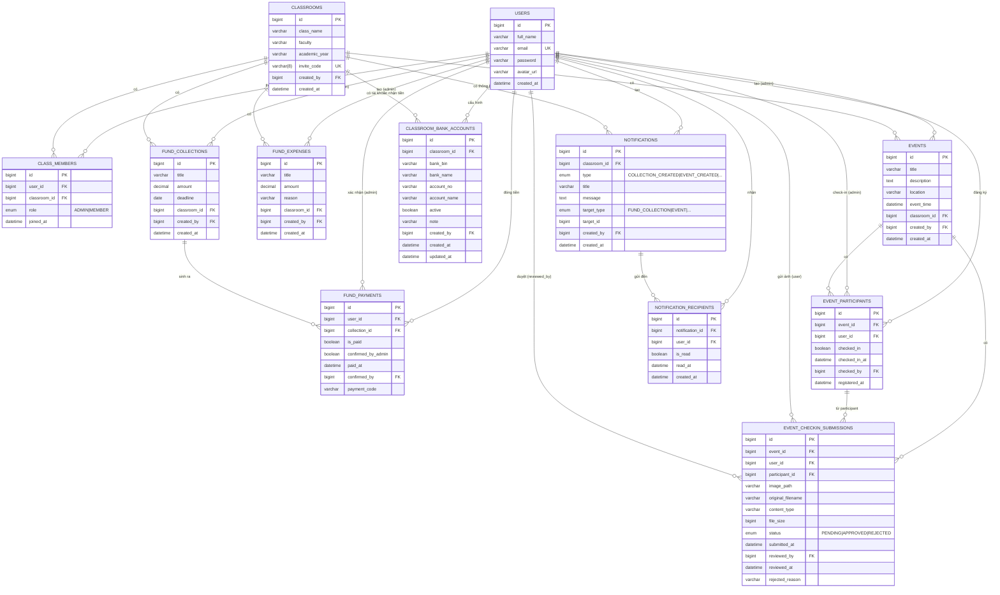

# 04 — Thiết kế CSDL / ERD

## 4.1. Tổng quan

ClassHub sử dụng **MySQL 8** với **12 bảng**. Mapping qua **JPA/Hibernate** (Spring Data JPA). Khi BE khởi động, `spring.jpa.hibernate.ddl-auto=update` tự sinh/cập nhật schema từ entity Java.

Database: `classhub_db` (charset `utf8mb4`).

## 4.2. Danh sách bảng

| # | Tên bảng | Mục đích | Số cột |
|---|---|---|---|
| 1 | `users` | Tài khoản người dùng | 6 |
| 2 | `classrooms` | Lớp học | 7 |
| 3 | `class_members` | Quan hệ user ↔ lớp + role | 5 |
| 4 | `fund_collections` | Đợt thu quỹ | 7 |
| 5 | `fund_payments` | Trạng thái đóng tiền của từng SV trong đợt thu | 8 |
| 6 | `fund_expenses` | Khoản chi | 7 |
| 7 | `events` | Sự kiện lớp | 8 |
| 8 | `event_participants` | Sinh viên đăng ký + check-in sự kiện | 7 |
| 9 | `classroom_bank_accounts` | Tài khoản ngân hàng nhận tiền theo lớp | 10 |
| 10 | `event_checkin_submissions` | Ảnh minh chứng điểm danh sự kiện | 13 |
| 11 | `notifications` | Thông báo in-app (tiêu đề, nội dung, loại, đối tượng liên quan) | 8 |
| 12 | `notification_recipients` | Quan hệ thông báo ↔ người nhận + trạng thái đã đọc | 5 |

## 4.3. Sơ đồ ERD (Mermaid)



## 4.4. Mô tả chi tiết từng bảng

### 4.4.1. `users` — Tài khoản người dùng

| Cột | Kiểu | Ràng buộc | Mô tả |
|---|---|---|---|
| `id` | BIGINT | PK, AUTO_INCREMENT | Khoá chính |
| `full_name` | VARCHAR(255) | NOT NULL | Họ tên đầy đủ |
| `email` | VARCHAR(255) | NOT NULL, UNIQUE | Email đăng nhập |
| `password` | VARCHAR(255) | NOT NULL | Hash BCrypt (~60 ký tự) |
| `avatar_url` | VARCHAR(255) | NULL | URL ảnh đại diện (chưa dùng) |
| `created_at` | DATETIME | NOT NULL, không update | Thời điểm đăng ký |

**Lý do thiết kế:**
- `email UNIQUE` → đảm bảo không trùng tài khoản.
- Password lưu **hash BCrypt**, không lưu plaintext. Cụ thể BCrypt nhúng salt vào hash → không cần cột salt riêng.
- **Không** có cột `role` ở User → role được tách ra `class_members` để hỗ trợ user là Admin lớp này nhưng Member lớp khác.

### 4.4.2. `classrooms` — Lớp học

| Cột | Kiểu | Ràng buộc | Mô tả |
|---|---|---|---|
| `id` | BIGINT | PK, AUTO_INCREMENT | |
| `class_name` | VARCHAR(255) | NOT NULL | Vd "64KTPM3" |
| `faculty` | VARCHAR(255) | NULL | Khoa, vd "Công nghệ thông tin" |
| `academic_year` | VARCHAR(255) | NULL | Khoá, vd "K64" |
| `invite_code` | VARCHAR(8) | NOT NULL, UNIQUE | Mã mời 6 ký tự uppercase |
| `created_by` | BIGINT | NOT NULL | ID người tạo (legacy, dùng Long thay vì FK) |
| `created_at` | DATETIME | NOT NULL | |

**Lý do thiết kế:**
- `invite_code UNIQUE` để join lớp không nhầm.
- Code length 8 dù sinh ra 6 ký tự → phòng thay đổi format sau này.
- `created_by` hiện lưu kiểu `Long`, chưa phải `@ManyToOne` (lệch chuẩn với các entity khác — đã ghi trong known issues, đưa vào hướng phát triển để refactor).

### 4.4.3. `class_members` — Quan hệ user ↔ lớp + role

| Cột | Kiểu | Ràng buộc | Mô tả |
|---|---|---|---|
| `id` | BIGINT | PK | |
| `user_id` | BIGINT | FK → `users.id`, NOT NULL | |
| `classroom_id` | BIGINT | FK → `classrooms.id`, NOT NULL | |
| `role` | ENUM | NOT NULL | `ADMIN` hoặc `MEMBER` |
| `joined_at` | DATETIME | NOT NULL | |

**Ràng buộc:**
```sql
UNIQUE KEY (user_id, classroom_id)
```
→ Một user không thể có 2 bản ghi trong cùng 1 lớp.

**Lý do thiết kế:**
- **Bảng liên kết n-n** giữa users và classrooms. Một user có thể tham gia nhiều lớp. Một lớp có nhiều thành viên.
- Role nằm ở **đây**, không phải ở users → user có thể là Admin lớp K64KTPM3 nhưng là Member lớp K64KHMT (thực tế nếu họ tham gia cả 2 lớp).
- Đây là design quan trọng để chống lỗi "phân quyền toàn cục" mà hội đồng dễ bắt.

### 4.4.4. `fund_collections` — Đợt thu

| Cột | Kiểu | Ràng buộc | Mô tả |
|---|---|---|---|
| `id` | BIGINT | PK | |
| `title` | VARCHAR(255) | NOT NULL | Vd "Quỹ lớp tháng 5" |
| `amount` | DECIMAL(19,2) | NOT NULL | Số tiền (BigDecimal) |
| `deadline` | DATE | NULL | Hạn đóng (chỉ ngày, không cần giờ) |
| `classroom_id` | BIGINT | FK, NOT NULL | |
| `created_by` | BIGINT | FK → users.id, NOT NULL | Admin tạo |
| `created_at` | DATETIME | NOT NULL | |

**Lý do:**
- Dùng `BigDecimal` (DECIMAL trong SQL) cho tiền — `double` có lỗi làm tròn (`0.1 + 0.2 != 0.3`).
- `deadline` dùng `DATE` (LocalDate) — không cần giờ phút, chỉ ngày đến hạn.

### 4.4.5. `fund_payments` — Trạng thái đóng của từng SV

| Cột | Kiểu | Ràng buộc | Mô tả |
|---|---|---|---|
| `id` | BIGINT | PK | |
| `user_id` | BIGINT | FK, NOT NULL | Sinh viên |
| `collection_id` | BIGINT | FK → fund_collections, NOT NULL | Đợt thu nào |
| `is_paid` | BOOLEAN | NOT NULL DEFAULT FALSE | |
| `confirmed_by_admin` | BOOLEAN | NOT NULL DEFAULT FALSE | |
| `paid_at` | DATETIME | NULL | Khi admin xác nhận |
| `confirmed_by` | BIGINT | FK → users.id, NULL | **Audit B3:** admin nào xác nhận |
| `payment_code` | VARCHAR(255) | NULL | Mã nội dung chuyển khoản duy nhất |

**Lý do:**
- Sinh tự động khi tạo đợt thu (cho all members) và khi member join lớp muộn (cho all collections hiện có).
- 2 boolean `is_paid` và `confirmed_by_admin` hiện luôn cùng giá trị (logic redundant — known issue, gộp thành enum status đưa vào hướng phát triển).
- `payment_code` sinh ra lần đầu khi user mở QR, lưu lại để admin đối soát với sao kê ngân hàng. Format: `QUY{collectionId}-SV{userId}-{epochMillis}`.
- `confirmed_by` cho phép truy vết "ai đã xác nhận" — yêu cầu audit trail.

### 4.4.6. `fund_expenses` — Khoản chi

| Cột | Kiểu | Ràng buộc | Mô tả |
|---|---|---|---|
| `id` | BIGINT | PK | |
| `title` | VARCHAR(255) | NULL | |
| `amount` | DECIMAL(19,2) | NULL | |
| `reason` | VARCHAR(255) | NULL | Lý do chi |
| `classroom_id` | BIGINT | FK, NOT NULL | |
| `created_by` | BIGINT | FK → users.id, NOT NULL | |
| `created_at` | DATETIME | NOT NULL | |

### 4.4.7. `events` — Sự kiện

| Cột | Kiểu | Ràng buộc | Mô tả |
|---|---|---|---|
| `id` | BIGINT | PK | |
| `title` | VARCHAR(255) | NOT NULL | |
| `description` | TEXT | NULL | |
| `location` | VARCHAR(255) | NULL | |
| `event_time` | DATETIME | NOT NULL | Thời gian bắt đầu |
| `classroom_id` | BIGINT | FK, NOT NULL | |
| `created_by` | BIGINT | FK → users.id, NOT NULL | |
| `created_at` | DATETIME | NOT NULL | |

**Note:** Chưa có `end_time` — đưa vào hướng phát triển.

### 4.4.8. `event_participants` — Đăng ký + check-in

| Cột | Kiểu | Ràng buộc | Mô tả |
|---|---|---|---|
| `id` | BIGINT | PK | |
| `event_id` | BIGINT | FK → events.id, NOT NULL | |
| `user_id` | BIGINT | FK → users.id, NOT NULL | |
| `checked_in` | BOOLEAN | NOT NULL DEFAULT FALSE | |
| `checked_in_at` | DATETIME | NULL | Thời điểm check-in |
| `checked_by` | BIGINT | FK → users.id, NULL | **Audit B4:** admin nào check-in |
| `registered_at` | DATETIME | NOT NULL | Khi sinh viên bấm đăng ký |

**Ràng buộc:**
```sql
UNIQUE KEY (event_id, user_id)
```
→ Một sinh viên không đăng ký 2 lần cho cùng 1 sự kiện. DB chặn ngay cả khi service có lỗi race condition.

### 4.4.9. `classroom_bank_accounts` — Tài khoản ngân hàng nhận tiền theo lớp

| Cột | Kiểu | Ràng buộc | Mô tả |
|---|---|---|---|
| `id` | BIGINT | PK, AUTO_INCREMENT | Khoá chính |
| `classroom_id` | BIGINT | FK → classrooms.id, NOT NULL | Lớp sở hữu tài khoản |
| `bank_bin` | VARCHAR(6) | NOT NULL | Mã ngân hàng VietQR (VD: 970422=MB, 970436=VCB) |
| `bank_name` | VARCHAR(100) | NOT NULL | Tên ngân hàng hiển thị cho user |
| `account_no` | VARCHAR(20) | NOT NULL | Số tài khoản nhận tiền |
| `account_name` | VARCHAR(100) | NOT NULL | Tên chủ tài khoản |
| `active` | BOOLEAN | NOT NULL DEFAULT TRUE | Chỉ 1 tài khoản active=true / 1 classroom |
| `note` | VARCHAR(500) | NULL | Ghi chú (lý do thay đổi tài khoản) |
| `created_by` | BIGINT | FK → users.id, NOT NULL | Admin tạo/cập nhật tài khoản |
| `created_at` | DATETIME | NOT NULL, không update | Thời điểm tạo |
| `updated_at` | DATETIME | NULL | Thời điểm cập nhật |

**Lý do thiết kế:**
- **Mỗi lớp có tài khoản riêng** thay vì dùng tài khoản cố định toàn hệ thống.
- **Giữ lịch sử**: Khi admin đổi tài khoản, hệ thống không xóa bản cũ mà chuyển `active=false` và tạo bản mới `active=true`.
- **QR động**: API sinh QR luôn lấy tài khoản có `active=true` của lớp đó.
- `bank_bin` dùng để build URL VietQR.
- `created_by` để audit ai đã cấu hình/thay đổi tài khoản (yêu cầu truy vết).

## 4.5. Quan hệ giữa các bảng (giải thích)

| Quan hệ | Cardinality | Bảng liên kết | Ý nghĩa nghiệp vụ |
|---|---|---|---|
| User ↔ Classroom | n-n | `class_members` | Một user có thể tham gia nhiều lớp; một lớp có nhiều thành viên |
| Classroom 1 — n FundCollection | 1-n | (FK trực tiếp) | Một lớp có nhiều đợt thu |
| FundCollection 1 — n FundPayment | 1-n | (FK trực tiếp) | Một đợt thu sinh ra N bản ghi nợ (N = số thành viên) |
| User 1 — n FundPayment | 1-n | (FK trực tiếp) | Một sinh viên có nhiều bản ghi đóng tiền (qua nhiều đợt) |
| User 1 — n FundPayment (confirmedBy) | 1-n | (FK trực tiếp) | Một admin có thể đã xác nhận nhiều payment |
| Classroom 1 — n FundExpense | 1-n | | |
| Classroom 1 — n Event | 1-n | | |
| Event 1 — n EventParticipant | 1-n | | Một sự kiện có nhiều người đăng ký |
| User 1 — n EventParticipant | 1-n | | Một sinh viên đăng ký nhiều sự kiện |
| User 1 — n EventParticipant (checkedBy) | 1-n | | Audit ai check-in |
| Event 1 — n EventCheckinSubmission | 1-n | | Một sự kiện có nhiều lượt gửi ảnh |
| User 1 — n EventCheckinSubmission (user) | 1-n | | Member gửi ảnh |
| EventParticipant 1 — n EventCheckinSubmission | 1-n | | Theo dõi lịch sử submit của 1 participant |
| User 1 — n EventCheckinSubmission (reviewedBy) | 1-n | | Admin duyệt/từ chối |
| Classroom 1 — n ClassroomBankAccount | 1-n | | Một lớp có nhiều tài khoản qua lịch sử (chỉ 1 active tại 1 thời điểm) |
| User 1 — n ClassroomBankAccount (createdBy) | 1-n | | Admin cấu hình tài khoản |
| Classroom 1 — n Notification | 1-n | | Một lớp có nhiều thông báo in-app liên quan đến nghiệp vụ của lớp |
| User 1 — n Notification (createdBy) | 1-n | | User/admin tạo hành động nghiệp vụ sinh thông báo |
| Notification 1 — n NotificationRecipient | 1-n | | Một thông báo gốc được fan-out đến nhiều người nhận |
| User 1 — n NotificationRecipient | 1-n | | Một user có nhiều notification recipient, mỗi recipient có trạng thái đọc riêng |

## 4.6. Quyết định thiết kế quan trọng

| Vấn đề | Quyết định | Lý do |
|---|---|---|
| Lưu role ở đâu? | Ở `class_members`, không ở `users` | Hỗ trợ multi-class với role khác nhau |
| Lưu tiền kiểu gì? | `BigDecimal` (DECIMAL) | Chính xác tuyệt đối, không có lỗi làm tròn |
| Mã mời sinh ra sao? | 6 ký tự uppercase từ UUID | Đủ chống đoán, đủ ngắn để gõ tay |
| Auto-sinh payment khi nào? | (1) Khi tạo collection (sinh cho all members), (2) Khi member join lớp (sinh cho all existing collections) | Đảm bảo không bỏ sót member nào |
| Audit trail | Lưu `confirmed_by` + `paid_at` ở payment; `checked_by` + `checked_in_at` ở participant | Hội đồng hỏi "ai làm" trả lời được |
| Chống đăng ký trùng | `UNIQUE(event_id, user_id)` + check ở service | 2 lớp bảo vệ: app + DB |
| Lưu ảnh minh chứng đâu? | File ngoài repo (`classhub.upload-dir`), DB chỉ lưu `image_path` và metadata | Không phình MySQL, dễ backup/di chuyển file riêng |
| Tại sao không nhét vào `event_participants`? | Tách bảng riêng `event_checkin_submissions` | Giữ lịch sử submit/reject/resubmit; 1 participant có thể có nhiều submission (gửi lại sau khi bị từ chối) |
| `/uploads/**` có bảo mật không? | Hiện public cho MVP/demo | Hướng phát triển: API download có JWT + phân quyền theo lớp/sự kiện |
| Timezone | `Asia/Ho_Chi_Minh` trong JDBC URL | Đảm bảo timestamp đúng giờ Việt Nam |
| Tài khoản ngân hàng | Tách bảng riêng, giữ history bằng active flag | Hỗ trợ mỗi lớp có tài khoản riêng; QR động theo lớp; admin có thể đổi tài khoản mà vẫn truy vết được lịch sử |
| Trạng thái đọc notification | Lưu ở `notification_recipients`, không lưu ở `notifications` | Mỗi user đọc thông báo ở thời điểm khác nhau; cùng một nội dung notification có thể gửi cho nhiều người |
| Điều hướng notification | `target_type` + `target_id` là FK ngầm | MVP hiện dùng để lưu đối tượng liên quan; sau này FE có thể dùng để deep-link đến sự kiện/khoản thu |

## 4.7. Script tạo DB (rút gọn)

```sql
CREATE DATABASE classhub_db CHARACTER SET utf8mb4 COLLATE utf8mb4_unicode_ci;
CREATE USER 'classhub_user'@'localhost' IDENTIFIED BY 'ClassHub@2026';
GRANT ALL PRIVILEGES ON classhub_db.* TO 'classhub_user'@'localhost';
```

Schema còn lại do **Hibernate `ddl-auto=update`** tự sinh khi khởi động Spring Boot lần đầu (đọc các `@Entity` Java).

## 4.8. Mô tả chi tiết bảng `event_checkin_submissions`

| Cột | Kiểu | Ràng buộc | Mô tả |
|---|---|---|---|
| `id` | BIGINT | PK, AUTO_INCREMENT | Khoá chính |
| `event_id` | BIGINT | FK → events.id, NOT NULL | Sự kiện |
| `user_id` | BIGINT | FK → users.id, NOT NULL | Member gửi ảnh |
| `participant_id` | BIGINT | FK → event_participants.id, NOT NULL | Participant tương ứng |
| `image_path` | VARCHAR(500) | NOT NULL | Đường dẫn relative: `/uploads/event-checkins/...` |
| `original_filename` | VARCHAR(255) | NULL | Tên file gốc từ FE |
| `content_type` | VARCHAR(100) | NULL | MIME type: `image/jpeg`, `image/png` |
| `file_size` | BIGINT | NULL | Kích cỡ byte |
| `status` | ENUM | NOT NULL | `PENDING`, `APPROVED`, `REJECTED` |
| `submitted_at` | DATETIME | NOT NULL, auto | Thời điểm gửi ảnh |
| `reviewed_by` | BIGINT | FK → users.id, NULL | Admin duyệt/từ chối |
| `reviewed_at` | DATETIME | NULL | Thời điểm duyệt |
| `rejected_reason` | VARCHAR(500) | NULL | Lý do từ chối |

## 4.9. Mô tả chi tiết bảng `notifications` và `notification_recipients`

### `notifications` — Thông báo

| Cột | Kiểu | Ràng buộc | Mô tả |
|---|---|---|---|
| `id` | BIGINT | PK, AUTO_INCREMENT | Khoá chính |
| `classroom_id` | BIGINT | FK → classrooms.id, NULL | Lớp liên quan (NULL = thông báo hệ thống) |
| `type` | ENUM | NOT NULL | `COLLECTION_CREATED`, `PAYMENT_CONFIRMED`, `EVENT_CREATED`, `CHECKIN_SUBMITTED`, `CHECKIN_APPROVED`, `CHECKIN_REJECTED` |
| `title` | VARCHAR(255) | NOT NULL | Tiêu đề ngắn, vd "Có khoản thu mới" |
| `message` | TEXT | NOT NULL | Nội dung đầy đủ |
| `target_type` | ENUM | NULL | Loại đối tượng liên quan: `FUND_COLLECTION`, `EVENT`, ... |
| `target_id` | BIGINT | NULL | ID đối tượng liên quan (FK ngầm) |
| `created_by` | BIGINT | FK → users.id, NULL | Admin tạo thông báo |
| `created_at` | DATETIME | NOT NULL, auto | Thời điểm tạo |

### `notification_recipients` — Người nhận thông báo

| Cột | Kiểu | Ràng buộc | Mô tả |
|---|---|---|---|
| `id` | BIGINT | PK, AUTO_INCREMENT | Khoá chính |
| `notification_id` | BIGINT | FK → notifications.id, NOT NULL | Thông báo |
| `user_id` | BIGINT | FK → users.id, NOT NULL | Người nhận |
| `is_read` | BOOLEAN | NOT NULL DEFAULT FALSE | Đã đọc chưa |
| `read_at` | DATETIME | NULL | Thời điểm đọc |
| `created_at` | DATETIME | NOT NULL, auto | Thời điểm gửi |

**Ràng buộc:**
```sql
UNIQUE KEY (notification_id, user_id)
```
→ Một user không nhận 2 bản sao cùng 1 thông báo.

**Lý do thiết kế:**
- Tách bảng `notifications` (nội dung) và `notification_recipients` (ai nhận, đã đọc chưa) → 1 thông báo gửi được cho nhiều người mà không trùng lập dữ liệu.
- `target_id` là FK ngầm (không có constraint DB) → linh hoạt cho nhiều `targetType` khác nhau mà không cần join table phức tạp.
- `REQUIRES_NEW` trong `NotificationService.createNotification()` tách transaction ghi notification khỏi transaction nghiệp vụ gọi nó. MVP hiện vẫn gọi đồng bộ, chưa có queue/retry riêng.

## 4.10. Tổng kết

- **12 bảng** đầy đủ cho 3 phân hệ + tài khoản ngân hàng động + ảnh minh chứng check-in + thông báo in-app.
- Quan hệ n-n giữa User và Classroom giải quyết qua bảng `class_members` — đây là điểm "đúng OOAD" nhất của thiết kế.
- Audit trail (`confirmed_by`, `checked_by`, `created_by` ở bank account, `reviewed_by` ở submission) đảm bảo truy vết được mọi hành động.
- Sử dụng các kiểu dữ liệu phù hợp: BigDecimal cho tiền, LocalDate cho hạn, LocalDateTime cho timestamp.
- **Tài khoản ngân hàng theo lớp** giải quyết bài toán mỗi lớp có quỹ riêng, QR thanh toán động, và giữ lịch sử thay đổi.
- **Ảnh minh chứng** lưu ngoài DB (file system), DB chỉ lưu path + metadata — tránh phình MySQL và dễ scale storage.
- **Thông báo in-app** thiết kế fan-out: 1 notification → N recipient records. FE polling `unread-count` khi vào HomeScreen, hiển thị badge số chưa đọc trên icon chuông.
