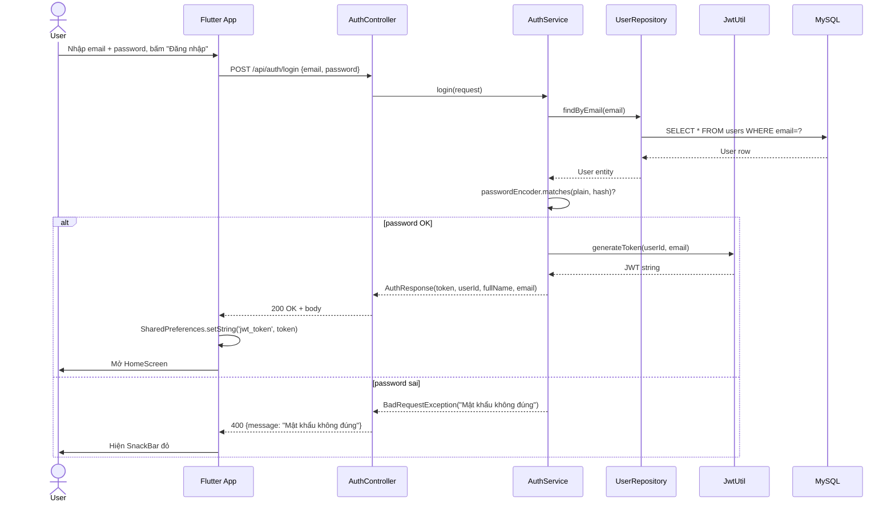
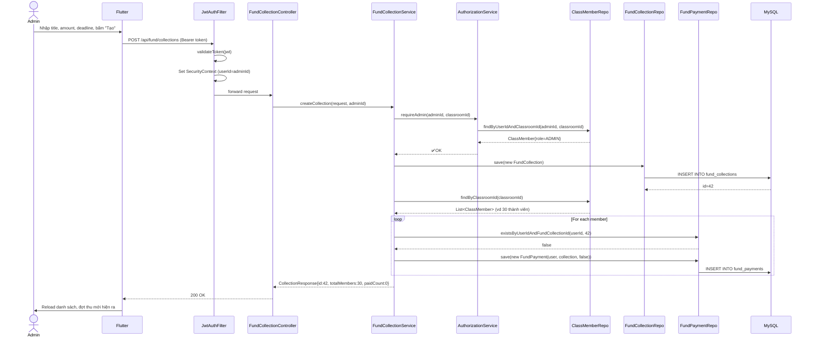
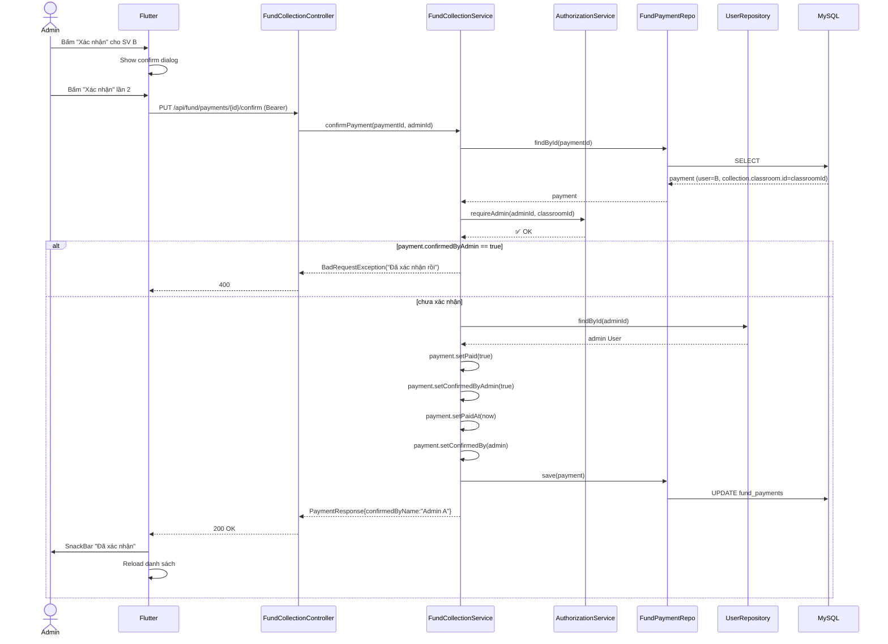
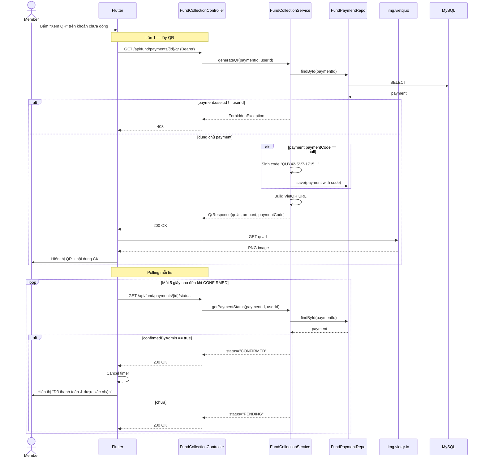
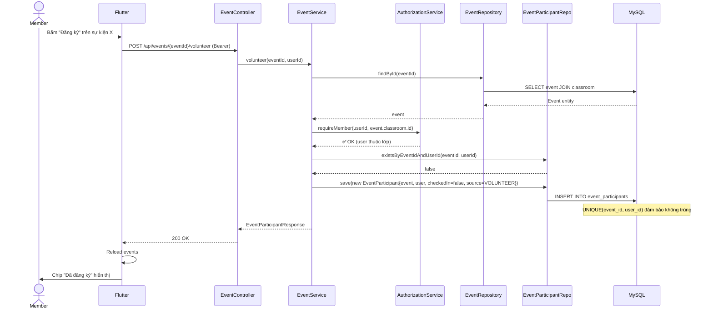
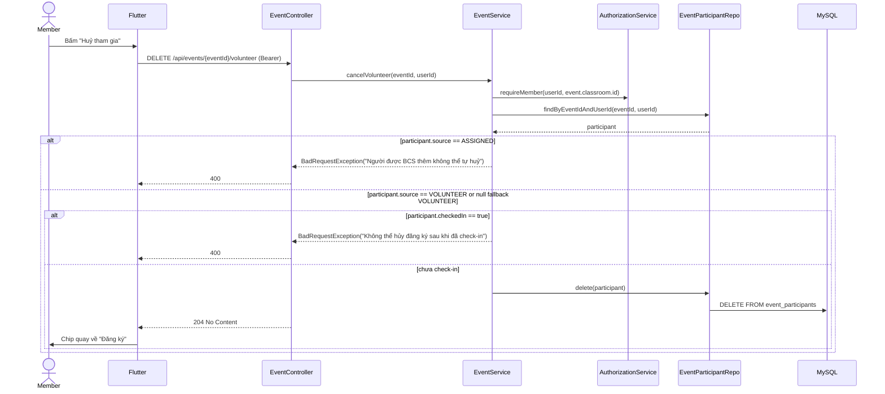
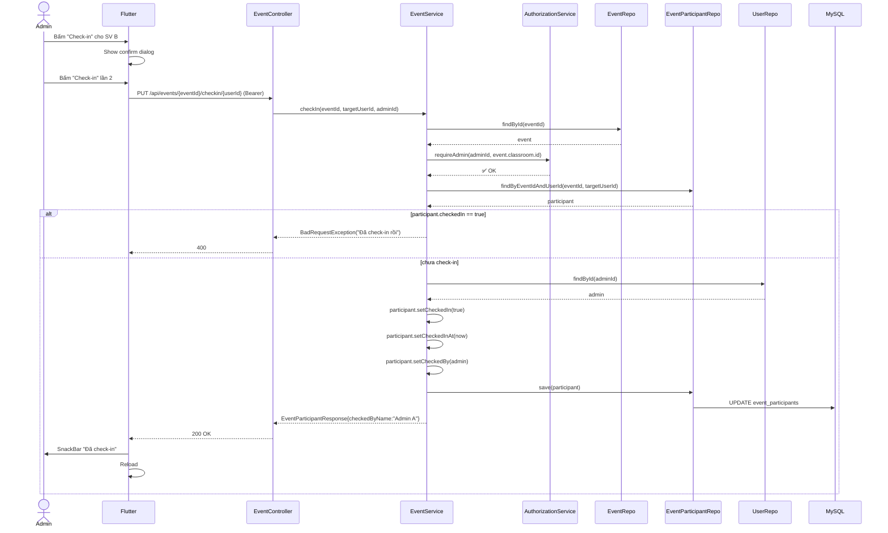
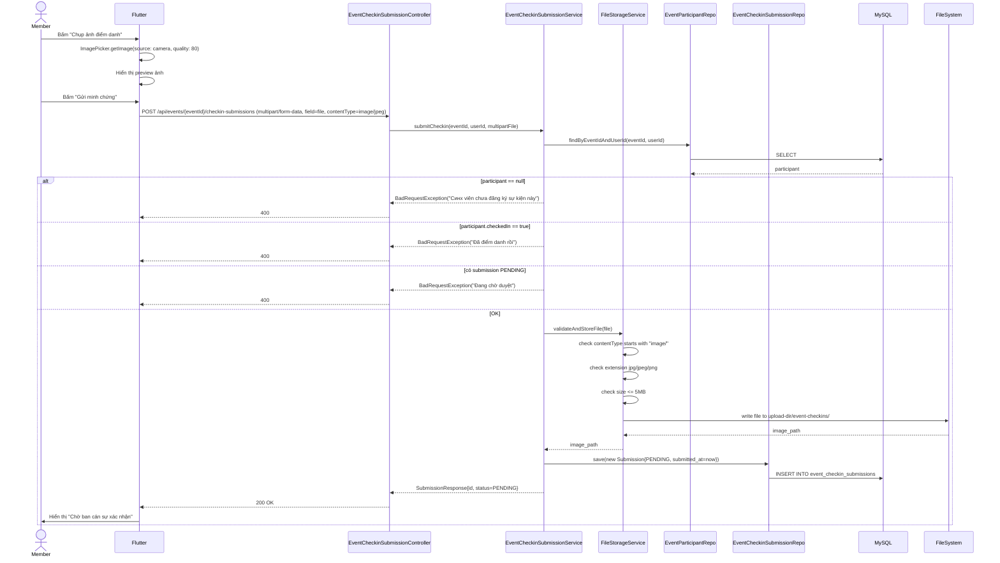
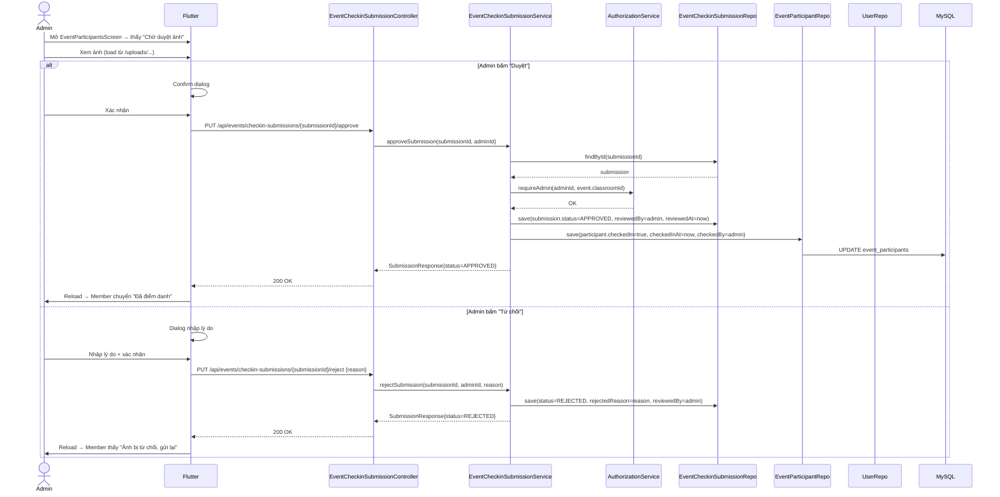

# 05 — Sequence Diagram

Tài liệu này mô tả 6 luồng nghiệp vụ chính bằng **Mermaid sequence diagram** (render được trên GitHub / VS Code preview).

## 5.1. Đăng nhập



## 5.2. Admin tạo khoản thu (auto-sinh payment cho all members)



## 5.3. Admin xác nhận thanh toán (B3: lưu confirmedBy + idempotency)



## 5.4. Sinh viên lấy QR thanh toán + polling



## 5.5. Sinh viên đăng ký tham gia sự kiện



## 5.6. Admin bổ sung người tham gia khi chưa đủ tối thiểu

```mermaid
sequenceDiagram
    actor A as Admin
    actor M as Member
    participant F as Flutter
    participant EC as EventController
    participant CC as ClassroomController
    participant ES as EventService
    participant AS as AuthorizationService
    participant ER as EventRepo
    participant CMR as ClassMemberRepo
    participant EPR as EventParticipantRepo
    participant UR as UserRepo
    participant DB as MySQL

    A->>F: Tạo sự kiện, nhập minParticipants
    F->>EC: POST /api/events {classroomId, title, eventTime, minParticipants}
    EC->>ES: createEvent(request, adminId)
    ES->>AS: requireAdmin(adminId, classroomId)
    ES->>ER: save(Event{minParticipants})
    ER->>DB: INSERT INTO events

    M->>F: Tự đăng ký tham gia
    F->>EC: POST /api/events/{eventId}/volunteer
    EC->>ES: volunteer(eventId, memberId)
    ES->>EPR: save(EventParticipant{source=VOLUNTEER})
    EPR->>DB: INSERT INTO event_participants

    A->>F: Mở chi tiết sự kiện
    F->>EC: GET /api/events/detail/{eventId}
    EC->>ES: getEventDetail(eventId, currentUserId)
    ES->>AS: requireMember(currentUserId, event.classroom.id)
    ES->>EPR: countByEventId(eventId)
    ES-->>EC: EventResponse{minParticipants, volunteerCount}
    EC-->>F: 200 OK
    F->>A: Hiển thị "Đã tham gia X/Y, còn thiếu N"

    alt chưa đủ người
        F->>CC: GET /api/classrooms/{classroomId}/members
        CC-->>F: Danh sách thành viên lớp
        A->>F: Chọn member cần thêm
        F->>EC: POST /api/events/{eventId}/participants/assign {userIds}
        EC->>ES: assignParticipants(eventId, userIds, adminId)
        ES->>AS: requireAdmin(adminId, event.classroom.id)
        ES->>ES: distinct(userIds)
        ES->>UR: findAllById(userIds)
        ES->>CMR: validate users thuộc lớp event
        ES->>EPR: find existing participants
        loop từng user hợp lệ chưa tham gia
            ES->>EPR: save(EventParticipant{source=ASSIGNED, assignedBy=admin, assignedAt=now})
            EPR->>DB: INSERT INTO event_participants
        end
        Note over ES,EPR: User đã tham gia thì skip; VOLUNTEER không đổi thành ASSIGNED
        ES-->>EC: List<EventParticipantResponse>
        EC-->>F: 200 OK
        F->>A: Reload detail/participants
    end
```

## 5.7. Sinh viên huỷ tham gia sự kiện



## 5.8. Admin check-in sự kiện (B4: lưu checkedBy)



## 5.9. Camera Check-in: Member gửi ảnh minh chứng



## 5.10. Camera Check-in: Admin duyệt / từ chối ảnh



## 5.11. Tổng kết

| Sequence | Tính nghiệp vụ chính được thể hiện |
|---|---|
| 5.1 Đăng nhập | Password hash + JWT generation |
| 5.2 Tạo khoản thu | Auto-sinh payment cho all members; requireAdmin |
| 5.3 Xác nhận thanh toán | Idempotency check; lưu confirmedBy |
| 5.4 QR + polling | Owner-only check; 5s polling; dispose timer |
| 5.5 Volunteer | requireMember; chống đăng ký trùng; lưu `source=VOLUNTEER` |
| 5.6 Assign participant | Admin xem tiến độ tối thiểu; validate member thuộc lớp; skip participant đã tồn tại; lưu `source=ASSIGNED` + audit |
| 5.7 Huỷ tham gia | Chặn `ASSIGNED`; `VOLUNTEER` chỉ huỷ được khi chưa check-in; dữ liệu cũ NULL fallback `VOLUNTEER` |
| 5.8 Check-in thủ công | requireAdmin; idempotency; lưu checkedBy |
| 5.9 Camera Check-in (gửi ảnh) | Multipart upload; validate contentType; FileStorageService; chống submit trùng |
| 5.10 Duyệt/Từ chối ảnh | requireAdmin; approve → set checkedIn; reject → lưu lý do; Member gửi lại được |

**Điểm chung của mọi sequence:**
- Mọi request (trừ /auth) đều đi qua `JwtAuthenticationFilter`.
- Service không tin user thông tin từ client — luôn check `AuthorizationService.requireMember/requireAdmin` trước action.
- Mọi action thay đổi state đều `@Transactional` để rollback nếu fail giữa chừng.
