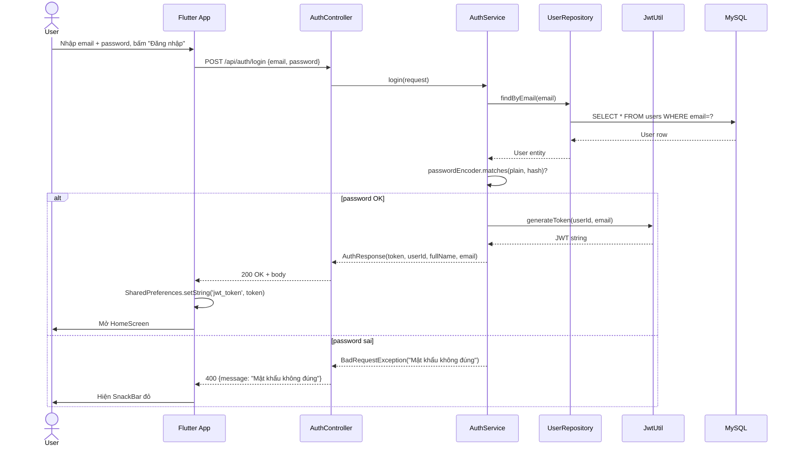
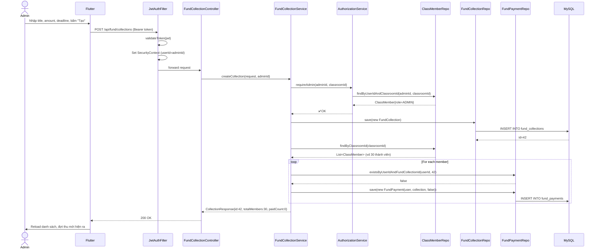
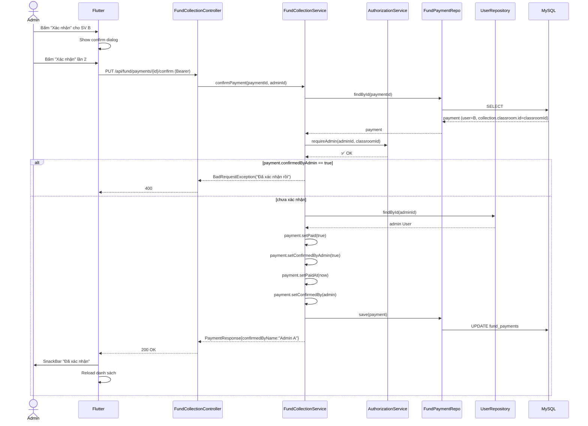
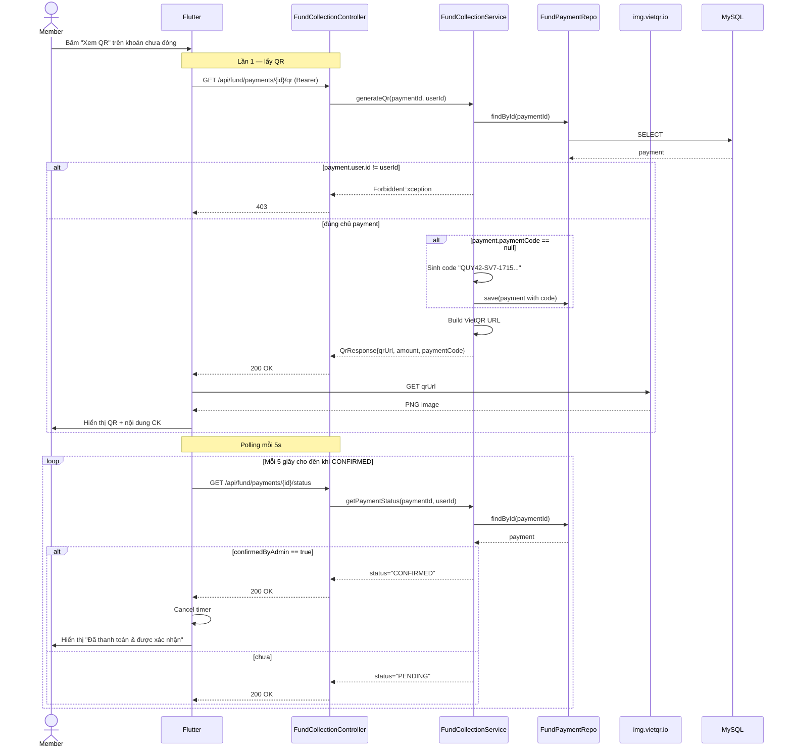
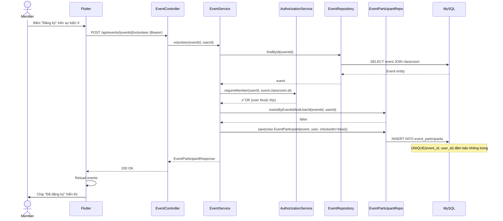
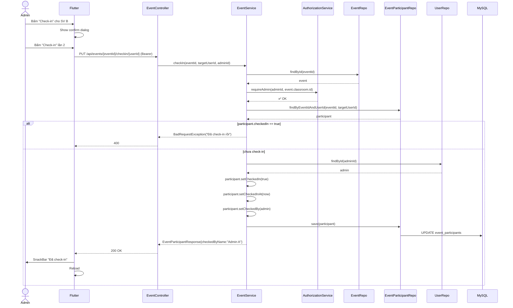

# 05 — Sequence Diagram

Tài liệu này mô tả 6 luồng nghiệp vụ chính bằng **Mermaid sequence diagram** (render được trên GitHub / VS Code preview).

## 5.1. Đăng nhập

## 5.2. Admin tạo khoản thu (auto-sinh payment cho all members)

## 5.3. Admin xác nhận thanh toán (B3: lưu confirmedBy + idempotency)

## 5.4. Sinh viên lấy QR thanh toán + polling

## 5.5. Sinh viên đăng ký tham gia sự kiện

## 5.6. Admin check-in sự kiện (B4: lưu checkedBy)

## 5.7. Tổng kết

| Sequence | Tính nghiệp vụ chính được thể hiện |
|---|---|
| 5.1 Đăng nhập | Password hash + JWT generation |
| 5.2 Tạo khoản thu | Auto-sinh payment cho all members; requireAdmin |
| 5.3 Xác nhận thanh toán | Idempotency check; lưu confirmedBy |
| 5.4 QR + polling | Owner-only check; 5s polling; dispose timer |
| 5.5 Volunteer | requireMember; chống đăng ký trùng |
| 5.6 Check-in | requireAdmin; idempotency; lưu checkedBy |

**Điểm chung của mọi sequence:**
- Mọi request (trừ /auth) đều đi qua `JwtAuthenticationFilter`.
- Service không tin user thông tin từ client — luôn check `AuthorizationService.requireMember/requireAdmin` trước action.
- Mọi action thay đổi state đều `@Transactional` để rollback nếu fail giữa chừng.
