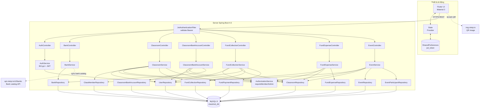

# 06 — Kiến trúc hệ thống

## 6.1. Tổng quan kiến trúc

ClassHub là **mobile application** theo mô hình **client-server 3 lớp**:

```
┌──────────────────────────────────────┐
│       Flutter Mobile App             │  ← Presentation
│  (Android, iOS sau này)              │
└───────────────┬──────────────────────┘
                │ HTTP/REST + JWT
                │ Authorization: Bearer <token>
                ↓
┌──────────────────────────────────────┐
│       Spring Boot Backend            │  ← Business Logic
│   • Controller (REST endpoint)       │
│   • Service (nghiệp vụ + authz)     │
│   • Repository (Spring Data JPA)     │
│   • Filter (JWT validation)          │
└───────────────┬──────────────────────┘
                │ JPA / Hibernate
                │ JDBC
                ↓
┌──────────────────────────────────────┐
│         MySQL Database               │  ← Persistence
│   (13 tables)                        │
└──────────────────────────────────────┘
```

## 6.2. Sơ đồ kiến trúc chi tiết



## 6.3. Công nghệ sử dụng

### 6.3.1. Backend

| Hạng mục | Công nghệ | Phiên bản | Vì sao chọn |
|---|---|---|---|
| Language | Java | 17 | LTS, stable, hỗ trợ tốt trong trường |
| Framework | Spring Boot | 4.0.5 | Tiêu chuẩn enterprise; có Spring Security + JPA |
| Build tool | Maven (mvnw) | 3.9 | Quen thuộc, có wrapper không cần cài tay |
| Persistence | Spring Data JPA + Hibernate | 6.x | Auto-mapping entity ↔ table |
| Database | MySQL | 8.0+ | Quan hệ, đề cương yêu cầu SQL |
| Security | Spring Security + jjwt | 0.12.6 | Chuẩn ngành |
| Validation | Hibernate Validator | 8.x | Validate DTO bằng annotation `@Valid` |
| Lombok | Project Lombok | — | Giảm boilerplate getter/setter |

### 6.3.2. Frontend

| Hạng mục | Công nghệ | Phiên bản |
|---|---|---|
| Language | Dart | 3.10+ |
| Framework | Flutter | 3.x |
| State management | Provider | 6.1 |
| HTTP client | http | 1.2 |
| Local storage | shared_preferences | 2.2 |
| UI | Material Design 3 | (built-in) |

### 6.3.3. Tools

| Mục đích | Tool |
|---|---|
| IDE BE | IntelliJ IDEA |
| IDE FE | Android Studio + Flutter plugin |
| Test API | Postman |
| VCS | Git + GitHub |
| Design | Figma |

## 6.4. Layered Architecture (backend)

Backend tổ chức theo **5 tầng** (chuẩn Spring Boot):

```
┌──────────────────────────────────────────┐
│ 1. Controller                            │   ← REST endpoint
│    @RestController, @RequestMapping      │     • Validate request (@Valid)
│                                          │     • Gọi service
│                                          │     • Trả DTO
└──────────────────────────────────────────┘
              │ uses
              ↓
┌──────────────────────────────────────────┐
│ 2. Service                               │   ← Nghiệp vụ + Authorization
│    @Service, @Transactional             │     • requireMember/requireAdmin
│                                          │     • Business logic
│                                          │     • Convert Entity ↔ DTO
└──────────────────────────────────────────┘
              │ uses
              ↓
┌──────────────────────────────────────────┐
│ 3. Repository                            │   ← Truy vấn DB
│    extends JpaRepository                 │     • CRUD chuẩn
│                                          │     • Custom query method
└──────────────────────────────────────────┘
              │ uses
              ↓
┌──────────────────────────────────────────┐
│ 4. Entity                                │   ← Map Java ↔ Table
│    @Entity, @Table                       │
└──────────────────────────────────────────┘

  Bên cạnh có:
  ┌────────────┐   ┌────────────┐   ┌──────────────────────┐
  │   DTO      │   │   Config   │   │     Exception        │
  │ Request/   │   │ Security/  │   │ BadRequestException  │
  │ Response   │   │ Jwt Filter │   │ ForbiddenException   │
  │            │   │            │   │ GlobalHandler        │
  └────────────┘   └────────────┘   └──────────────────────┘
```

### Tại sao 5 tầng?
- **Controller** mỏng — chỉ làm việc với HTTP. Dễ test riêng.
- **Service** chứa logic nghiệp vụ + authorization → tái sử dụng được, không bị trộn với HTTP.
- **Repository** trừu tượng hoá DB — đổi từ MySQL sang Postgres chỉ cần đổi driver.
- **Entity** thuần JPA — tách khỏi DTO để response không lộ field nhạy cảm (password hash).
- **DTO** tách input/output khỏi entity — thay đổi DB không ảnh hưởng API contract.

## 6.5. Luồng request điển hình (FE → BE → DB → FE)

```
1. Flutter: gọi http.put('/api/fund/payments/123/confirm',
                          headers: {Authorization: 'Bearer eyJh...'})

2. Spring Security: vào filter chain
   2a. JwtAuthenticationFilter đọc Bearer token
       → JwtUtil.validateToken(token) — verify HMAC signature
       → JwtUtil.getUserIdFromToken(token) — extract claim userId
       → SecurityContextHolder.setAuthentication(userId)
   2b. Spring kiểm tra route /api/** authenticated → OK (đã có context)

3. Controller (FundCollectionController.confirm):
   - @PathVariable Long paymentId
   - Lấy adminId = SecurityUtil.currentUserId()
   - Gọi fundCollectionService.confirmPayment(paymentId, adminId)

4. Service (FundCollectionService.confirmPayment):
   - findById(paymentId) → load FundPayment với LAZY relations
   - Lấy classroomId = payment.fundCollection.classroom.id (lazy load)
   - authorizationService.requireAdmin(adminId, classroomId)
     → ClassMemberRepository.findByUserIdAndClassroomId
     → check role == ADMIN
   - Idempotency check
   - findById(adminId) → load admin User
   - payment.setConfirmedBy(admin), setPaidAt, etc.
   - fundPaymentRepository.save(payment)
   - Convert sang PaymentResponse

5. Controller trả ResponseEntity.ok(response)

6. Spring serialize PaymentResponse → JSON
   Response body: {"id":123, "isPaid":true, "confirmedByName":"Admin A", ...}

7. Flutter:
   - Parse JSON → Payment.fromJson
   - Update UI: card chuyển xanh
   - Show SnackBar "Đã xác nhận thanh toán"
```

## 6.6. Authentication & Authorization

### 6.6.1. Authentication (xác thực — anh là ai?)

```
Đăng nhập:
   email + password → POST /api/auth/login
   ↓
   BCrypt verify password
   ↓
   JwtUtil.generateToken(userId, email)
   ↓
   Trả JWT token
   ↓
   Flutter lưu SharedPreferences['jwt_token']

Mọi request tiếp theo:
   Authorization: Bearer <jwt>
   ↓
   JwtAuthenticationFilter
   ↓
   Verify signature + extract userId
   ↓
   SecurityContext.setAuthentication(userId)
   ↓
   Controller dùng SecurityUtil.currentUserId()
```

JWT cấu trúc:
```
Header:  {"alg":"HS256"}
Payload: {"sub":"phong@example.com", "userId":7,
          "iat":1715783000, "exp":1715869400}
Signature: HMAC-SHA256(payload, secret)
```

### 6.6.2. Authorization (phân quyền — anh có được làm không?)

Sau khi xác thực, mỗi action gọi:
```java
authorizationService.requireMember(userId, classroomId);
// hoặc
authorizationService.requireAdmin(userId, classroomId);
```

`AuthorizationService` query `class_members` table → kiểm tra:
- User có thuộc lớp không? (requireMember)
- Role có phải ADMIN không? (requireAdmin)

Vi phạm → `ForbiddenException` → `GlobalExceptionHandler` trả **403 JSON**.

### 6.6.3. Tại sao tách Authentication và Authorization?
- **Authentication một lần** ở filter (mỗi request).
- **Authorization theo từng action** ở service (tuỳ thao tác).
- Cùng 1 user có thể là Admin lớp X (làm được FR-3.1) nhưng là Member lớp Y (không làm được).
- Filter không biết user định làm gì với lớp nào → không thể authorize ở filter, phải xuống service.

## 6.7. External integration

### VietQR QR image (img.vietqr.io)
- Backend chỉ **sinh URL** chuẩn VietQR cho ảnh QR thanh toán, không gọi API ảnh QR từ server.
- Flutter `Image.network(qrUrl)` tự tải PNG về.
- URL format:
  ```
  https://img.vietqr.io/image/{bankBin}-{accountNo}-compact2.png
    ?amount={amount}
    &addInfo={paymentCode}
    &accountName={accountName}
  ```
- Không phụ thuộc network giữa BE và VietQR → BE vẫn chạy được khi VietQR down (chỉ Flutter không tải được ảnh).

### VietQR Bank catalog (api.vietqr.io/v2/banks)
- `BankService.syncBanksFromVietQr()` gọi `vietqr.banks-url=https://api.vietqr.io/v2/banks`.
- Dữ liệu được upsert vào bảng `banks` theo `bin`; FE đọc danh sách qua `GET /api/banks`.
- `POST /api/banks/sync` hiện chỉ yêu cầu JWT hợp lệ, chưa tách quyền admin hệ thống riêng.

## 6.8. Triển khai (deployment)

### Hiện trạng đồ án (chạy local):
```
Sinh viên máy laptop:
   - MySQL chạy ở localhost:3306
   - Spring Boot chạy ở localhost:8080
   - Flutter Android emulator gọi http://10.0.2.2:8080
```

### Hướng triển khai thực tế (nếu deploy):
```
Cloud:
   - Backend: Docker container trên VPS (DigitalOcean / AWS EC2)
   - Database: MySQL managed (PlanetScale / AWS RDS)
   - Domain + HTTPS (Let's Encrypt)

Mobile:
   - Build APK signed → Google Play (review 2-7 ngày)
   - iOS: TestFlight rồi App Store (sau khi có Mac + Apple Dev account)
```

## 6.9. Đặc điểm thiết kế

| Đặc điểm | Hiện thực |
|---|---|
| **Stateless** | JWT, không session ở BE → scale ngang dễ |
| **RESTful** | Resource-based URLs, HTTP verbs đúng (`POST`/`GET`/`PUT`/`DELETE`) |
| **Layered** | 5 tầng tách biệt, dễ test từng tầng |
| **DRY** | AuthorizationService gom logic check role; GlobalExceptionHandler gom xử lý lỗi |
| **Defensive** | Validate ở DTO + check ở service + unique constraint ở DB (3 lớp) |
| **Audit** | Lưu confirmedBy, checkedBy → truy vết được mọi hành động admin |

## 6.10. Mã nguồn

- **Backend repo:** `github.com/agio7/classhub-api`
- **Frontend repo:** `github.com/agio7/classhub-app`

Cấu trúc thư mục backend:
```
classhub-api/
├── src/main/java/com/classhub/classhubapi/
│   ├── ClasshubApiApplication.java
│   ├── config/        (JwtUtil, JwtAuthenticationFilter, JwtAuthenticationEntryPoint,
│   │                   SecurityConfig, SecurityUtil)
│   ├── controller/    (Auth, Bank, Classroom, ClassroomBankAccount,
│   │                   Event, EventCheckinSubmission, FundCollection,
│   │                   FundExpense, Notification)
│   ├── service/       (Auth, Authorization, Bank, Classroom,
│   │                   ClassroomBankAccount, Event, EventCheckinSubmission,
│   │                   FileStorage, FundCollection, FundExpense, Notification)
│   ├── repository/    (13 repository: User, Bank, Classroom, ClassMember,
│   │                   ClassroomBankAccount, FundCollection, FundPayment,
│   │                   FundExpense, Event, EventParticipant,
│   │                   EventCheckinSubmission, Notification,
│   │                   NotificationRecipient)
│   ├── entity/        (13 entity chính: User, Bank, Classroom, ClassMember,
│   │                   ClassroomBankAccount, FundCollection, FundPayment,
│   │                   FundExpense, Event, EventParticipant,
│   │                   EventCheckinSubmission, Notification,
│   │                   NotificationRecipient; kèm enum)
│   ├── dto/           (26 DTO: Request/Response các loại)
│   └── exception/     (BadRequestException, ForbiddenException, GlobalExceptionHandler)
├── src/main/resources/application.properties
├── pom.xml
└── mvnw / mvnw.cmd
```

Cấu trúc thư mục frontend:
```
classhub_app/
├── lib/
│   ├── main.dart
│   ├── core/          Design system (added 2026-05)
│   │   ├── theme/     (app_colors, app_spacing, app_radius,
│   │   │               app_text_styles, app_theme)
│   │   ├── widgets/   (AppCard, AppButton, AppInput, AppPickerField,
│   │   │               AppSectionTitle, AppEmptyState, AppErrorState,
│   │   │               AppLoading, PaymentStatusBadge)
│   │   └── utils/     (formatters: formatVnd, formatDate, formatDateTime)
│   ├── models/        (app_notification, bank, class_member,
│   │                   classroom_bank_account, event, expense,
│   │                   fund_collection, payment)
│   ├── services/      (auth_service, classroom_service, event_service,
│   │                   fund_service, notification_service)
│   ├── providers/     (auth_provider)
│   └── screens/
│       ├── (login, signup, home, create_classroom, join_classroom,
│       │    classroom_detail, classroom_bank_account, notification)
│       ├── fund/      (fund_tab, payment_qr, collection_payments,
│       │               create_collection, expenses_screen, create_expense)
│       └── events/    (events_tab, create_event, event_participants)
├── pubspec.yaml
└── android/, ios/, web/, ...
```
